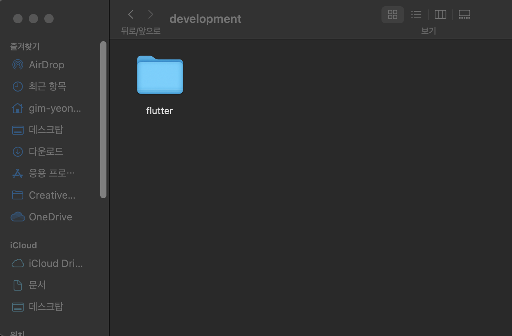

# [Flutter] 맥북 플러터 설치방법 & Xcode 설치오류


✔ 맥에서 플러터를 설치하는 과정 중  **필수 사항**으로 먼저 확인해야 할것이 있다.

###  노트북 필수사양 확인하기

💻 **Mac 필수사양: 버전 10.11 이상**


## 1) 권장사항

1. **macOS**(내 Mac OS 사양 확인해보기!)

2. **여유 용량: 50GB**( **iOS 개발시 필요한 Xcode가 용량이 많이 필요하다**)

   

- 확인 방법

  1. 화면 좌상단의 **Apple 로고 클릭**

  2. **이 Mac에 관하여 클릭**


  3. **Mac OS 버전을 확인**해보자.

  

## 2) 설치 프로그램

[꿀팁!] 설치할 프로그램 한 줄 요약! 

- Flutter : Android와 iOS 앱을 하나의 코드로 구현할 수 있도록 도와주는 프레임워크 
- VSCode : 코드를 작성할 때 사용하는 에디터 
-  Android Studio : Android 앱을 개발하기 위해 필요한 IDE. 에뮬레이터 포함 
- Xcode : iOS 앱을 개발하기 위해 필요한 IDE. 에뮬레이터 포함

## 3) 설치 방법

**[프레임워크 설치하기]**

1. 먼저 flutter 를 설치할 폴더를 만들어야한다. 

* Downloads 폴더를 먼저 열어준다. (아래와 같이 유저명과 같은 이름의 폴더로 이동하면 된다.)
* 이제 여기에 development 라는 이름의 폴더를 생성한다.
* 이제 생성한 폴더에 flutter 압축 파일을 다운로드한다. (Chrome 브라우저에서 [링크](https://docs.flutter.dev/get-started/install/macos)를 열어준다.)


* 밑으로 조금 스크롤한 뒤, 파란색 버튼을 클릭해 다운로드를 진행한다.




* 이후 다운로드 한 플러터 zip파일을 development >flutter안에 압축해제해준다.

**[환경 변수 설정]**

* 바탕화면에서 사과 아이콘 → 이 Mac에 관하여를 클릭하여 macOS 버전을 확인한다.
* macOS 버전을 확인한 뒤, 해당하는 명령어를 복사한다.


- macOS 카타리나(Catalina) `**이상**`버전 명령어 (최신 버전은 여기에요!)

```bash
echo 'export PATH="$PATH:$HOME/development/flutter/bin"' >> ~/.zshrc && source ~/.zshrc
```

- macOS 모하비(Mojave) **`이하`** 버전 명령어

```bash
echo 'export PATH="$PATH:$HOME/development/flutter/bin"' >> 	~/.bash_profile && source ~/.bash_profile
```

* 복사한 명령어를 터미널에 붙여넣기 한후 실행한다.

* 다음 명령어는 flutter의 버전을 확인하는 명령어이다. 아래 명령어를 복사해 다시터미널에붙여넣고 실행한다.

```bash
flutter --version
```

실행하면 Building flutter tool... 이라고 출력되고 잠시 후 아래와 같이 Flutter 버전이 출력되면 Flutter 설치 완료!

* 다음 명령어를 복사해 터미널에 붙여넣고 실행한다.(Flutter 개발하는데 필요한 항목들의 상태를 확인하는 명령어이다.)


```bash
flutter doctor
```


**[에디터 설치하기]**

- VSCode 설치

  1. [링크](https://code.visualstudio.com/download)에 접속해 애플 아이콘 하단에 있는 파란색 Mac 버튼을 클릭한다.
  2. 폴더를 다운로드 한후 압축을 해제하면 아래와같은 팝업이 뜨는데 열기 해준후 다운로드한다.

  

  

* VSCode는 Flutter 뿐만 아니라 다양한 개발을 모두 할 수 있는 통합 에디터다. VSCode에서 Flutter 앱 개발을 하려면 VSCode에 Extension 탭에서 아래 목록의 Extension 들을 설치해야 한다.

	​	Flutter : VSCode에서 Flutter 개발 환경 지원 

	​	Dart : Flutter 개발 시 사용되는 Dart 개발 환경 지원

    

* VS코드를 설치한후 실행하면 좌측에 extension 아이콘(동그라미)을 선택해 준다.

  

* flutter 라고 검색한 뒤, 해당 익스텐션을 선택하고 install 버튼을 눌러 설치한다.


* 위 `flutter` 익스텐션을 설치하면서 `dart` 익스텐션도 일반적으로 함께 설치가 된다

  `dart` 라고 검색하신 뒤 혹시 설치가 안되었다면 해당 익스텐션도 같이 설치한다. `uninstall`이라고 뜬다면 이미 설치가 된 것이니 넘어가시면 된다.


**[IDE 설치하기]**

- Android Studio 설치

  [링크](https://developer.android.com/studio)에 접속한 뒤, `Download Android Studio` 버튼을 눌러준다.

- Intel 칩을 사용하는 맥북은 왼쪽 Mac with Intel chip을 Apple 칩을 사용하는 맥북은 오른쪽 Mac with Apple chip을 선택한다.


* 아래와 같은 창이 뜨면 왼쪽에 Android Studio를 드래그해서 Applications에 떨어뜨려설치해준다.


* Android Studio에서 More Actions를 선택한 뒤 SDK Manager를 선택해 준다.


* 그러면 아래와 같이 Preferences for New Projects 팝업이 뜨면 SDK Tools 탭을 선택 → Android SDK Command-line Tools (latest) 선택 → Apply 를 선택해 준다.


* 설치가 완료되면 Finish 버튼을 눌러준다.

* 이후 디바이스를 만들어 줄 것이다.

  More Actions → Virtual Device Manager (또는 AVD Manager)를 선택해 준다.


​		이미 Device 가 있는 분들은 아래 절차를 진행하지 않아도 된다.

* (Device 가 없는 경우) **Create Virtual Device...**를 선택해 준다.
* 하드웨어를 선택하는 화면이 나오면 Next를 눌러서 기본으로 설정된 Pixel 2 휴대폰을 설치하도록 한다.


* 휴대폰에 설치할 Android OS를 선택하는 화면입니다. Q 옆에 있는 Download 버튼을 클릭하여 OS를 다운로드해 준다.

  

* 설치후 Q 옆에다운로드 표시가 없어졌으면 넥스트 클릭
* Finish 버튼을 눌러 Virtual Device 설치를 완료해주기


* 독스에 있는 Android Studio 아이콘을 우클릭한 뒤 종료 버튼을 눌러를 Android Studio를 종료해 줘야한다.

터미널에서 flutter doctor라고 입력한 뒤 엔터를 누릅니다. 아래와 같이 Android toolchain의 좌측에  [!] 표시가 되어있다.


문제를 해결하기 위해 flutter doctor --android-licenses를 복사해서 터미널에 붙여 넣고 실행해 준다. 실행시 라이센스에 대한 동의를 여러번 구하는데, y를 입력하고 엔터를 눌러 진행해 준다.


모든 동의가 완료되면 All SDK package licenses accepted 라고 뜬다.


**[Xcode설치]**

* [링크](https://xcodereleases.com/)를 클릭해 열어준다.

​	컴퓨터 사양을 확인후 사양에 맞는 Xcode를 설치해준다.

* 이제 Homebrew를 설치해줘야한다.

```bash
/bin/bash -c "$(curl -fsSL https://raw.githubusercontent.com/Homebrew/install/HEAD/install.sh)"
```


* 다음으로 CocoaPods을 설치해 보겠다. (아래 명령어를 복사해 터미널에서 붙여넣고 엔터를 눌러준다.)

```bash
brew install cocoapods
sudo gem install cocoapods
```

이 과정에서 오류가 발생했다!!


GPT에게 물어보니 cocoaPods을 다운로드 하는와중에 오류가 났다고 한다.
그래서 아래와같이 터미널 명령어를 실행해주었다.

1. Ruby를 업데이트하기 위해 RVM (Ruby Version Manager)을 설치한다.

```bash
\curl -sSL https://get.rvm.io | bash -s stable
```

2. RVM을 활성화합니다. 터미널에서 다음 명령을 실행한다.

```bash
source ~/.rvm/scripts/rvm
```

3. Ruby 2.7.0을 설치합니다. 터미널에서 다음 명령을 실행한다.

```bash
rvm install 2.7.0
```

4. 설치된 Ruby 2.7.0을 사용하도록 설정합니다. 터미널에서 다음 명령을 실행한다.

```bash
rvm use 2.7.0 --default
```

5. Ruby 버전이 업데이트되었으므로 CocoaPods를 설치할 수 있다. 터미널에서 다음 명령을 실행한다.

```bash
sudo gem install cocoapods
```


하지만 다시 아래와같은 오류가 났다.

(Ruby 버전을 업데이트하는 과정에서 문제가 발생했고, Ruby 2.7.0을 설치하고 설정하려고 했지만 제대로 되지 않았다고 한다.)

```bash
ERROR:  Error installing cocoapods:
	The last version of activesupport (>= 5.0, < 8) to support your Ruby & RubyGems was 6.1.7.3. Try installing it with `gem install activesupport -v 6.1.7.3` and then running the current command again
	activesupport requires Ruby version >= 2.7.0. The current ruby version is 2.6.6.146.
gim-yeonghyeon@gim-yeonghyeon-ui-MacBookPro ~ % 
```

이후 루비버전을 업데이트하고 CocoaPods을 설치해보았다.

1. 터미널에서 다음 명령을 실행하여 Ruby를 업데이트합니다.

```bash
brew install rbenv
rbenv install 2.7.0
rbenv global 2.7.0
```

2. Ruby 업데이트 후에는 다음 명령으로 `gem`을 업데이트합니다.

```bash
gem update --system
```

3. 이제 다시 CocoaPods을 설치해보자.

```bash
sudo gem install cocoapods
```


마지막으로 터미널에 flutter doctor 를 입력했을 때 아래와 같이 모든 항목에 초록색체크가 표시되면 완료!


