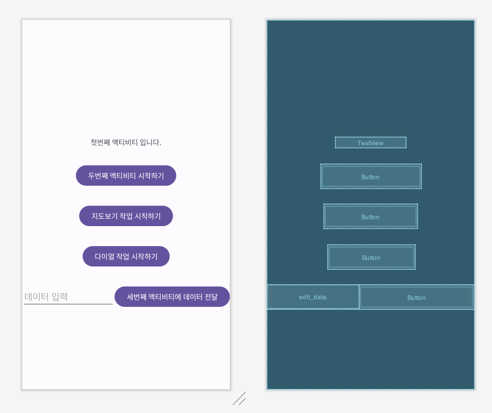
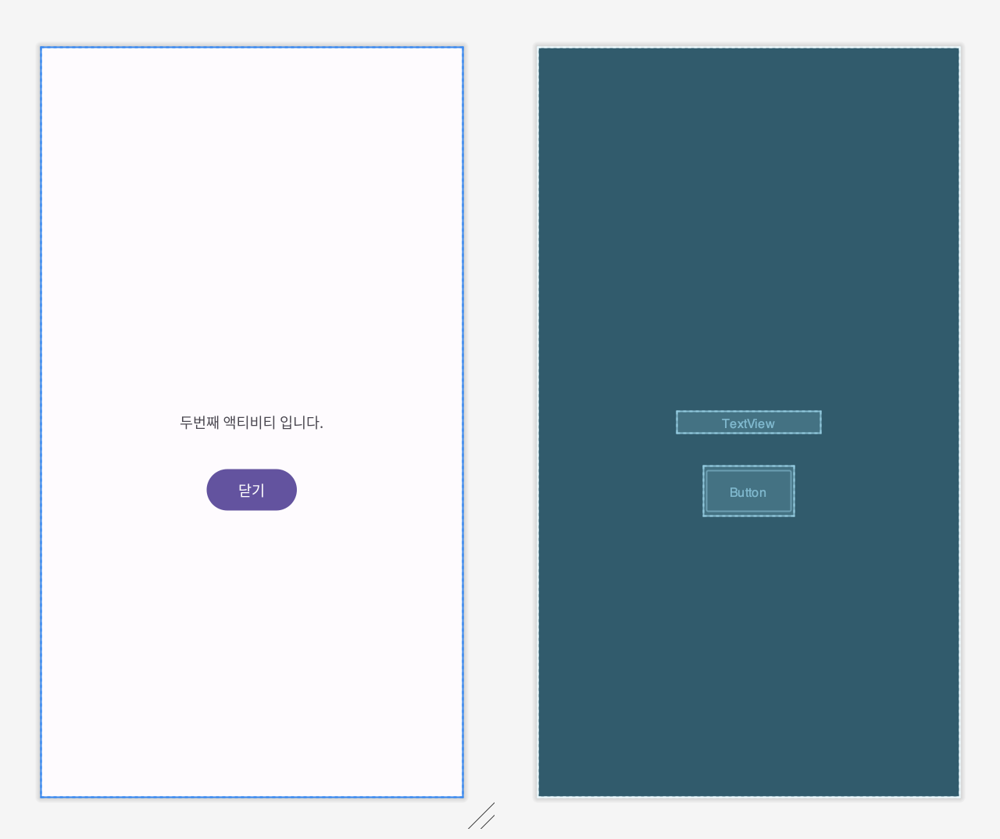
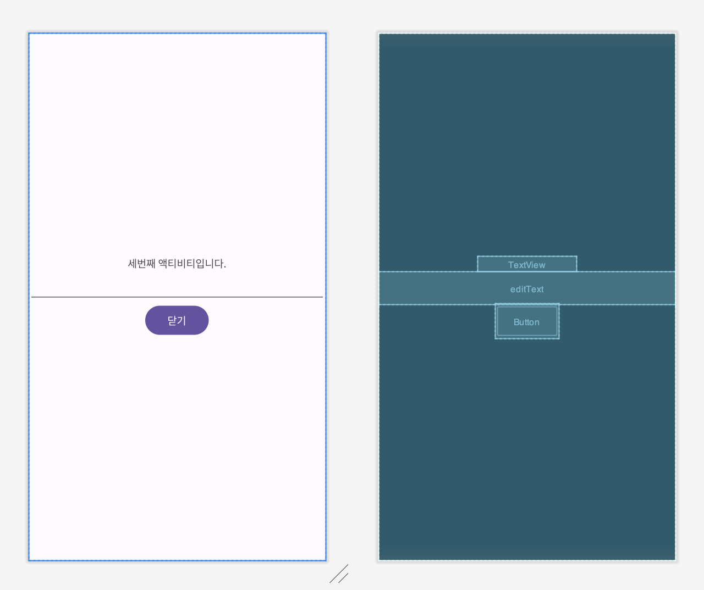

# [TIL] 액티비티와 인텐트

* toc
{:toc}
---

## 1) Activity란?

- 액티비티(Activity)는 사용자와 상호 작용 할 수 있는 화면을 제공하는 애플리케이션의 구성요소이다.
  - **예 : 전화걸기, 사진찍기, 이메일 보내기 또는 지도보기 등**
- 액티비티마다 창(Window)이 하나 씩 주어져 이곳에 사용자 인터페이스를 끌어올(draw)수있다.
  - **사용자 인터페이스는View객체들로 구성**
- **안드로이드앱은 화면에 UI를 표시하기 위해 최소 하나의Activity를 가져야 하며, 앱 실행시 지정된 Activity를 실행하여 사용자에게 UI를 표시한다.**


## 2) Android Manifest 역할

- 애플리케이션 패키지 이름 (애플리케이션의 고유한 식별자 역할) 설정
- 애플리케이션 **구성요소들을 설명**
- 이 애플리케이션과 상호작용하는 다른 애플리케이션이 가져야할 **권한** 설정
- 애플리케이션에서 사용하는 **라이브러리** 설정
- 애플리케이션이 필요로 하는 **Android API의 최소 수준** 설정


## 3) Intent란 무엇일까?

- **인텐트(Intent)**는 일종의 메시지 객체이다.
- 이것을 사용해 다른 앱 구성요소(액티비티, 서비스, 브로드 캐스트리시버)로 작업을 요청 할수 있다.


## 4) Intent의 유형

### 1. `명시적 인텐트(Explicit Intent)`

- 시작할 구성요소의 이름을 인텐트객체에 설정하고 이를`startActivity() `또는`startService()`에넘긴다.
- 보통 현재 앱안에있는 구성요소(예,액티비티나서비스)를 시작시킬 때 사용한다.

---

### 2. `암시적 인턴트(Implicit Intent)`

- 시작 할 구성 요소의 이름을 지정하지 않고 일반적인 작업 (예,전화걸기,지도보기등)을 인텐트 객체에 설정하고 이를 startActivity()에 넘긴다.
- 안드로이드 시스템은 모든 앱을 검색하여 해당 인텐트와 일치하는 인텐트 필터를 찾고, 일치된 인텐트 필터를 포함한 앱 구성 요소를 시작시킨다.
  - **인턴트 필터란 해당 구성 요소가 수신하고자 하는 인텐트의 유형을 나타낸것이다.**
- 보통 다른 앱 안에있는 **구성 요소를 구동**하는데 사용된다.


## **과제 완료 - 결과코드**

### FirstActivity.kt

```kotlin
//FirstActivity.kt

class FirstActivity : AppCompatActivity() {
    override fun onCreate(savedInstanceState: Bundle?) {
        super.onCreate(savedInstanceState)
        setContentView(R.layout.activity_first)

        val btn = findViewById<Button>(R.id.btn_start)
        btn.setOnClickListener {
            val intent= Intent(this,SecondActivity::class.java)
            startActivity(intent)
        }

        val btn_call3 = findViewById<Button>(R.id.buttonThirdActivity)
        btn_call3.setOnClickListener {
            val edit_text = findViewById<EditText>(R.id.edit_data)
            val strData = edit_text.text.toString()
            val intent = Intent(this, ThirdActivity::class.java)
            intent.putExtra("dataFromFirstActivity",strData)
            startActivity(intent)
        }

    }

    /**
     * 버튼 클릭 이벤트 처리
     * @param view : 클릭된 버튼 객체
     *
     * 클릭된 버튼 객체가 무엇인지를 id를 통해 인지하여, 두 가지 다른 인텐트 객체를 생성
     */
    fun doOnBtnClick(view: View) {
        when (view.getId()) {
            R.id.buttonDialActivity -> {     // 114 전화번호로 다이얼 작업을 수행할 수 있도록 인텐트 설정
                val call_intent = Intent(Intent.ACTION_DIAL, Uri.parse("tel:114"))
                startActivity(call_intent)
            }
            R.id.buttonMapActivity -> {     // 주어진 위도,경도 위치로 지도를 보여줄 수 있도록 인텐트 설정
                val map_intent = Intent(Intent.ACTION_VIEW, Uri.parse("geo:37.565350, 127.01445"))
                startActivity(map_intent)
            }
        }
    }
}

//activity_first.xml

<?xml version="1.0" encoding="utf-8"?>
<androidx.constraintlayout.widget.ConstraintLayout xmlns:android="http://schemas.android.com/apk/res/android"
    xmlns:app="http://schemas.android.com/apk/res-auto"
    xmlns:tools="http://schemas.android.com/tools"
    android:layout_width="match_parent"
    android:layout_height="match_parent"
    tools:context=".FirstActivity">

    <TextView
        android:id="@+id/textView"
        android:layout_width="wrap_content"
        android:layout_height="wrap_content"
        android:text="첫번째 액티비티 입니다."
        app:layout_constraintBottom_toBottomOf="parent"
        app:layout_constraintEnd_toEndOf="parent"
        app:layout_constraintHorizontal_bias="0.498"
        app:layout_constraintStart_toStartOf="parent"
        app:layout_constraintTop_toTopOf="parent"
        app:layout_constraintVertical_bias="0.326" />

    <Button
        android:id="@+id/btn_start"
        android:layout_width="wrap_content"
        android:layout_height="wrap_content"
        android:layout_marginTop="32dp"
        android:text="두번째 액티비티 시작하기"
        app:layout_constraintEnd_toEndOf="parent"
        app:layout_constraintStart_toStartOf="parent"
        app:layout_constraintTop_toBottomOf="@+id/textView" />

    <Button
        android:id="@+id/buttonDialActivity"
        android:layout_width="wrap_content"
        android:layout_height="wrap_content"
        android:layout_marginTop="32dp"
        android:onClick="doOnBtnClick"
        android:text="다이얼 작업 시작하기"
        app:layout_constraintEnd_toEndOf="parent"
        app:layout_constraintStart_toStartOf="parent"
        app:layout_constraintTop_toBottomOf="@+id/buttonMapActivity" />

    <Button
        android:id="@+id/buttonMapActivity"
        android:layout_width="wrap_content"
        android:layout_height="wrap_content"
        android:layout_marginTop="32dp"
        android:onClick="doOnBtnClick"
        android:text="지도보기 작업 시작하기"
        app:layout_constraintEnd_toEndOf="parent"
        app:layout_constraintStart_toStartOf="parent"
        app:layout_constraintTop_toBottomOf="@+id/btn_start" />

    <LinearLayout
        android:layout_width="match_parent"
        android:layout_height="wrap_content"
        android:layout_marginTop="32dp"
        android:orientation="horizontal"
        app:layout_constraintTop_toBottomOf="@+id/buttonDialActivity">

        <EditText
            android:id="@+id/edit_data"
            android:layout_width="wrap_content"
            android:layout_height="wrap_content"
            android:layout_weight="1"
            android:hint="데이터 입력" />

        <Button
            android:id="@+id/buttonThirdActivity"
            android:layout_width="wrap_content"
            android:layout_height="wrap_content"
            android:text="세번째 액티비티에 데이터 전달" />
    </LinearLayout>

</androidx.constraintlayout.widget.ConstraintLayout>

```



---

### SecondActivity.kt

```kotlin
//SecondActivity.kt
class SecondActivity : AppCompatActivity() {
    override fun onCreate(savedInstanceState: Bundle?) {
        super.onCreate(savedInstanceState)
        setContentView(R.layout.activity_second)

        val btn=findViewById<Button>(R.id.btn_close)
        btn.setOnClickListener {
            finish()
        }
    }
}
//activity_second.xml
<?xml version="1.0" encoding="utf-8"?>
<androidx.constraintlayout.widget.ConstraintLayout xmlns:android="http://schemas.android.com/apk/res/android"
    xmlns:app="http://schemas.android.com/apk/res-auto"
    xmlns:tools="http://schemas.android.com/tools"
    android:layout_width="match_parent"
    android:layout_height="match_parent"
    tools:context=".SecondActivity">

    <Button
        android:id="@+id/btn_close"
        android:layout_width="wrap_content"
        android:layout_height="wrap_content"
        android:layout_marginTop="32dp"
        android:text="닫기"
        app:layout_constraintEnd_toEndOf="parent"
        app:layout_constraintStart_toStartOf="parent"
        app:layout_constraintTop_toBottomOf="@+id/textView" />

    <TextView
        android:id="@+id/textView"
        android:layout_width="wrap_content"
        android:layout_height="wrap_content"
        android:text="두번째 액티비티 입니다."
        app:layout_constraintBottom_toBottomOf="parent"
        app:layout_constraintEnd_toEndOf="parent"
        app:layout_constraintStart_toStartOf="parent"
        app:layout_constraintTop_toTopOf="parent" />
</androidx.constraintlayout.widget.ConstraintLayout>

```



---

### ThirdActivity.kt

```kotlin
//ThirdActivity.kt
class ThirdActivity : AppCompatActivity() {
    override fun onCreate(savedInstanceState: Bundle?) {
        super.onCreate(savedInstanceState)
        setContentView(R.layout.activity_third)

        val strData = intent.getStringExtra("dataFromFirstActivity")
        val editText = findViewById<EditText>(R.id.editText)
        editText.setText(strData)

        val btn_close = findViewById<Button>(R.id.buttonThirdActivity)
        btn_close.setOnClickListener{
            finish()
        }
    }
}

//activity_third.xml
<?xml version="1.0" encoding="utf-8"?>
<LinearLayout xmlns:android="http://schemas.android.com/apk/res/android"
    xmlns:tools="http://schemas.android.com/tools"
    android:layout_width="match_parent"
    android:layout_height="match_parent"
    android:gravity="center"
    android:orientation="vertical">

    <TextView
        android:id="@+id/textView2"
        android:layout_width="wrap_content"
        android:layout_height="wrap_content"
        android:text="세번째 액티비티입니다." />

    <EditText
        android:id="@+id/editText"
        android:layout_width="match_parent"
        android:layout_height="wrap_content"
        android:inputType="text" />

    <Button
        android:id="@+id/buttonThirdActivity"
        android:layout_width="wrap_content"
        android:layout_height="wrap_content"
        android:text="닫기" />
</LinearLayout>

```


