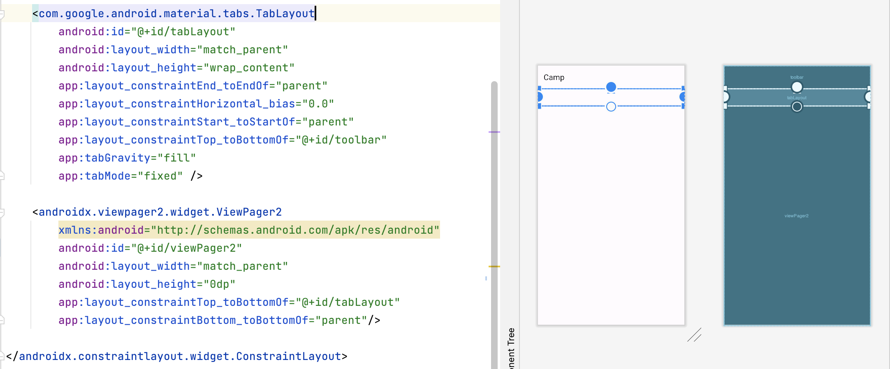

# [kotlin] ViewPager2를 사용해 TabLayout 만들기 

* toc
{:toc}
---


오늘은 하나의 탭 화면에서 옆으로 **스와이프**하여 탭을 전환하는 방법을 공부 해보려고 한다.

위와 같이 2개의 페이지로 구성 할 것이다.


---

## activity_main.xml 




```xml
<com.google.android.material.tabs.TabLayout
        android:id="@+id/tabLayout"
        android:layout_width="match_parent"
        android:layout_height="wrap_content"
        app:layout_constraintEnd_toEndOf="parent"
        app:layout_constraintHorizontal_bias="0.0"
        app:layout_constraintStart_toStartOf="parent"
        app:layout_constraintTop_toBottomOf="@+id/toolbar"
        app:tabGravity="fill"
        app:tabMode="fixed" />

    <androidx.viewpager2.widget.ViewPager2
        xmlns:android="http://schemas.android.com/apk/res/android"
        android:id="@+id/viewPager2"
        android:layout_width="match_parent"
        android:layout_height="0dp"
        app:layout_constraintTop_toBottomOf="@+id/tabLayout"
        app:layout_constraintBottom_toBottomOf="parent"/>
```

* activity_main.xml 에다음과 같이 `TabLayout`, `ViewPager2` 를 추가해준다.
* 여기서 각자의 **id** 를 지정해주고 잘 기억해두자.


---

## FragmentPageAdapter 파일 생성


```kotlin
package com.example.camp

import androidx.fragment.app.Fragment
import androidx.fragment.app.FragmentManager
import androidx.lifecycle.Lifecycle
import androidx.viewpager2.adapter.FragmentStateAdapter

class FragmentPageAdapter(
    fragmentManager: FragmentManager,// Fragment를 관리하기 위한 FragmentManager 인스턴스
    lifecycle: Lifecycle //라이프사이클 이벤트를 처리하기 위한 Lifecycle 인스턴스

  
) : FragmentStateAdapter(fragmentManager, lifecycle){
  	// 페이지의 개수를 반환하는 메서드
    override fun getItemCount(): Int {
        return 2//2개의 페이지 생성 하겠다고 지정
    }
		
  // 지정된 위치(position)에 따라 해당하는 Fragment를 생성하는 메서드
    override fun createFragment(position: Int): Fragment {
        return if (position==0)// 첫 번째 페이지일 경우
            TodoFragment()
        else// 그 외의 경우 (두 번째 페이지일 경우)
            BookMarkFragment()
    }
}
```

* Fragment 기반의 페이지를 관리하고 표시하기 위해 `FragmentPageAdapter` 를 생성해 줄것이다.
* **New > Fragment > Fragment (Blank)** 경로로 `FragmentPageAdapter` 파일을 생성해준다.
* 이 클래스는 `ViewPager2`와 함께 사용하여 여러 프래그먼트를 페이지로 스와이프하며 표시하는 데 사용된다.


---

## FragmentPage 생성 

필자는 2개의 스와이프 페이지를 구성하기위해 2개의 Fragment파일을 생성해주었다.

필요한 만큼 FragmentPage를 만들어주면 된다.

💡**파일을 만드는 경로는 여전히 New > Fragment > Fragment (Blank) 이다!**

---

### TodoFragment

```kotlin
class TodoFragment : Fragment() {
		// 프래그먼트의 UI를 생성하고 반환하는 메서드
    override fun onCreateView(
        inflater: LayoutInflater,
        container: ViewGroup?,
        savedInstanceState: Bundle?
    ): View? {
        return inflater.inflate(R.layout.fragment_todo, container, false)
       // fragment_todo 레이아웃 파일을 인플레이트하여 UI를 생성하고 반환
    }
		// 새로운 TodoFragment 인스턴스를 생성하는 메서드
    fun newInstant() : TodoFragment
    {
        val args = Bundle()
        val frag = TodoFragment()
        frag.arguments = args
        return frag
    }
```

---

### BookMarkFragment

```kotlin
class BookMarkFragment : Fragment() {
  	// 프래그먼트의 UI를 생성하고 반환하는 메서드
    override fun onCreateView(
        inflater: LayoutInflater,
        container: ViewGroup?,
        savedInstanceState: Bundle?
    ): View? {
        return inflater.inflate(R.layout.fragment_book_mark, container, false)
      // fragment_book_mark 레이아웃 파일을 인플레이트하여 UI를 생성하고 반환
    }
		// 새로운 BookMarkFragment 인스턴스를 생성하는 메서드
    fun newInstant() : BookMarkFragment
    {
        val args = Bundle()
        val frag = BookMarkFragment()
        frag.arguments = args
        return frag
    }
}
```

---


## MainActivity 추가

```kotlin
class MainActivity : AppCompatActivity() {

    private lateinit var tabLayout: TabLayout
    private lateinit var viewPager2: ViewPager2
    private lateinit var adapter: FragmentPageAdapter

    override fun onCreate(savedInstanceState: Bundle?) {
        super.onCreate(savedInstanceState)
        setContentView(R.layout.activity_main)

        // 툴바 설정
        val toolbar: androidx.appcompat.widget.Toolbar = findViewById(R.id.toolbar)
        setSupportActionBar(toolbar)
        
        // ViewPager2 및 TabLayout 초기화
        viewPager2 = findViewById(R.id.viewPager2)
        tabLayout = findViewById(R.id.tabLayout)

        adapter = FragmentPageAdapter(supportFragmentManager, lifecycle)
        
        // TabLayout에 탭을 추가
        tabLayout.addTab(tabLayout.newTab().setText("Todo")) // "Todo" 탭 추가
        tabLayout.addTab(tabLayout.newTab().setText("Bookmark")) // "Bookmark" 탭 추가

        viewPager2.adapter = adapter // ViewPager2에 어댑터 설정

        // TabLayout의 탭 선택 리스너 설정
        tabLayout.addOnTabSelectedListener(object : TabLayout.OnTabSelectedListener {
            override fun onTabSelected(tab: TabLayout.Tab?) {
                if (tab != null) {
                    viewPager2.currentItem = tab.position // 선택된 탭에 해당하는 페이지로 이동
                }
            }

            override fun onTabUnselected(tab: TabLayout.Tab?) {
                // 사용하지 않음
            }

            override fun onTabReselected(tab: TabLayout.Tab?) {
                // 사용하지 않음
            }
        })
        
        // ViewPager2의 페이지 변경 콜백 설정
        viewPager2.registerOnPageChangeCallback(object : ViewPager2.OnPageChangeCallback() {
            override fun onPageSelected(position: Int) {
                super.onPageSelected(position)
                tabLayout.selectTab(tabLayout.getTabAt(position)) // 페이지 변경 시 탭도 변경
            }
        })
    }
}
```

* 이 클래스는 ViewPager2와 TabLayout을 사용하여 두 개의 프래그먼트 페이지 (`TodoFragment` 및 `BookMarkFragment`)를 관리하고 표시한다.
* 여기서 ` ViewPager2 및 TabLayout 초기화` 부분 아래의 코드를 추가해주면 바로화면스와이프가 가능하다!


이렇게 화면 구현이 완료되었다!🎉
